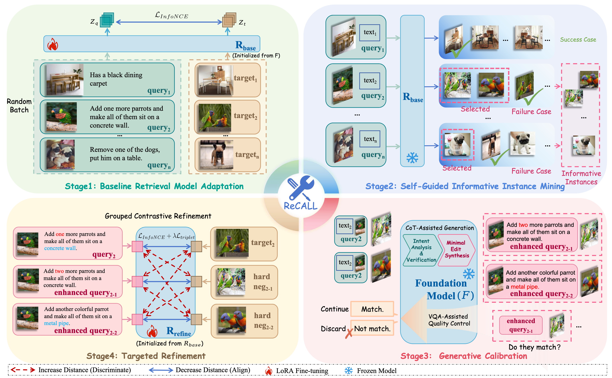

# ReCALL: Recalibrating Capability Degradation for MLLM-based Composed Image Retrieval

<p align="center">
  
</p>

ReCALL is an iterative training framework for **Composed Image Retrieval (CIR)** that combines hard negative mining with foundation model augmentation. Built on top of VLM2Vec, it supports multiple Vision-Language Model (VLM) backbones and achieves strong results on CIRR and FashionIQ benchmarks.

## Features

- **Iterative Training**: Progressive hard negative mining across multiple training rounds, with independent optimizer/scheduler per iteration
- **Multi-Backbone Support**: Qwen2-VL, Qwen2.5-VL, LLaVA-NeXT, and additional baselines (ColPali, GME, LamRA, InternVideo2, Phi-3V)
- **Foundation Model Augmentation**: Uses a foundation VLM (e.g., Qwen2.5-VL-7B) to generate augmented captions from hard negative pairs
- **Distributed Training**: Multi-GPU support via `torchrun` with grouped sampling strategies
- **Flexible Evaluation**: Unified evaluation pipeline for CIRR and FashionIQ with distributed inference

## Installation

```bash
pip install -r requirements.txt
```

Key dependencies: PyTorch 2.6+, Transformers 4.52+, PEFT 0.11+, Flash Attention 2.6+.

## Project Structure

```
Recall/
├── train_iterative.py              # Main training entry point
├── eval_cirr.py                    # CIRR evaluation script
├── eval_fashioniq.py               # FashionIQ evaluation script
├── cirr_test_submission.py         # CIRR test server submission generator
├── retrieval_cirr.py               # Standalone CIRR retrieval (top-k results)
├── run_iterative_training_paratuning.sh  # Training launcher script
├── eval_cirr.sh                    # CIRR evaluation launcher
├── eval_fashioniq.sh               # FashionIQ evaluation launcher
├── run_fashioniq_training.sh       # FashionIQ training launcher
├── configs/
│   ├── cirr_iterative.yaml         # CIRR iterative training config
│   ├── cirr_eval_config.yaml       # CIRR evaluation config
│   ├── fashioniq_iterative.yaml    # FashionIQ iterative training config
│   └── fashioniq_eval_config.yaml  # FashionIQ evaluation config
├── src/
│   ├── arguments.py                # Training/model/data argument definitions
│   ├── loss.py                     # Contrastive loss functions
│   ├── trainer.py                  # Base MMEBTrainer (extends HF Trainer)
│   ├── trainer_iterative_.py       # Iterative trainer with mining/augmentation
│   ├── dist_utils.py               # Distributed training utilities
│   ├── aug/                        # Caption augmentation pipeline
│   │   ├── batchers.py
│   │   ├── caption_generator.py
│   │   └── validators.py
│   ├── data/
│   │   ├── dataset/
│   │   │   ├── base_iterative_dataset.py  # Base iterative dataset
│   │   │   ├── cirr.py                    # CIRR dataset
│   │   │   ├── fashioniq.py               # FashionIQ dataset
│   │   │   └── hf_datasets.py             # HuggingFace dataset integration
│   │   ├── collator/              # Train/eval data collators
│   │   ├── loader/                # Mixed dataset loader
│   │   ├── sampler/               # Grouped & category samplers
│   │   └── utils/                 # Vision & dataset utilities
│   ├── evaluation/
│   │   ├── cirr_evaluator.py      # CIRR evaluator
│   │   └── fashioniq_evaluator.py # FashionIQ evaluator
│   ├── mining/
│   │   └── hard_negative.py       # Hard negative mining
│   ├── model/
│   │   ├── model.py               # MMEBModel (main model wrapper)
│   │   ├── processor.py           # Processor loading & backbone detection
│   │   ├── baseline_backbone/     # Baseline model implementations
│   │   └── vlm_backbone/          # VLM backbone implementations (Qwen2-VL, etc.)
│   ├── prompt/                    # Prompt builders for different VLMs
│   │   ├── qwen/                  # Qwen-specific prompts
│   │   ├── llava/                 # LLaVA-specific prompts
│   │   └── generic/               # Generic prompt builder
│   ├── retrieval/
│   │   ├── candidate_builder.py   # Retrieval candidate management
│   │   ├── embedding_cache.py     # Embedding caching
│   │   └── engine.py              # Retrieval engine
│   └── utils/                     # General utilities (logging, paths, etc.)
└── experiments/                   # Output directory for training runs
```

## Supported Models

| Model | Backbone Key | Notes |
|-------|-------------|-------|
| Qwen2-VL-2B-Instruct | `qwen2_vl` | Lightweight, fast training |
| Qwen2-VL-7B-Instruct | `qwen2_vl` | Default backbone |
| Qwen2.5-VL-7B-Instruct | `qwen2_5_vl` | Improved VL model |
| LLaVA-NeXT-7B | `llava_next` | Alternative backbone |
| ColPali, GME, LamRA, InternVideo2, Phi-3V | various | Baseline comparisons |

## Datasets

### CIRR (Composed Image Retrieval on Real-life Images)
- Image-text composed retrieval on natural images
- Train/dev/test splits with group-level evaluation
- Config: `configs/cirr_iterative.yaml`

**Download**: Follow the instructions in the [CIRR official repository](https://github.com/Cuberick-Orion/CIRR) to download the dataset. After downloading, the expected directory structure is:

```
CIRR/
├── dev/                          # Dev split images (NLVR2 source)
├── test1/                        # Test split images
├── cirr/
│   ├── captions/
│   │   ├── cap.rc2.train.json    # Training captions
│   │   ├── cap.rc2.val.json      # Validation captions
│   │   └── cap.rc2.test1.json    # Test captions
│   └── image_splits/
│       ├── split.rc2.train.json  # Training image split
│       ├── split.rc2.val.json    # Validation image split
│       └── split.rc2.test1.json  # Test image split
```

### FashionIQ
- Fashion domain composed retrieval across categories (dress, shirt, toptee)
- Category-aware sampling and evaluation
- Config: `configs/fashioniq_iterative.yaml`

**Download**: Follow the instructions in the [FashionIQ official repository](https://github.com/XiaoxiaoGuo/fashion-iq) to download the dataset. After downloading, the expected directory structure is:

```
FashionIQ/
├── images/                       # Product images
│   ├── B00006M009.jpg
│   ├── ...
├── captions/
│   ├── cap.dress.train.json      # Dress training captions
│   ├── cap.dress.val.json        # Dress validation captions
│   ├── cap.shirt.train.json
│   ├── cap.shirt.val.json
│   ├── cap.toptee.train.json
│   └── cap.toptee.val.json
```

After downloading, update the `data_dir` and `image_base_dir` paths in the corresponding config files under `configs/`.

## Training

### Quick Start

```bash
# CIRR training with Qwen2.5-VL-7B on 2 GPUs
./run_iterative_training_paratuning.sh cirr qwen2_5vl_7b 2

# FashionIQ training
./run_fashioniq_training.sh
```

### Direct Python Training

```bash
python train_iterative.py \
    --model_name /path/to/Qwen2.5-VL-7B-Instruct \
    --foundation_model_name /path/to/Qwen2.5-VL-7B-Instruct \
    --lora --lora_r 64 \
    --pooling eos --normalize True \
    --dataset_config configs/cirr_iterative.yaml \
    --output_dir ./experiments/my_experiment \
    --per_device_train_batch_size 64 \
    --learning_rate 2e-5 \
    --bf16 True \
    --group_by_reference_image
```

### Resume Training

```bash
# Resume from an existing experiment directory
./run_iterative_training_paratuning.sh cirr qwen2_5vl_7b 2 ./experiments/existing_run

# Or via Python with auto-resume
python train_iterative.py \
    --output_dir ./experiments/existing_run \
    --dataset_config configs/cirr_iterative.yaml \
    --resume_from auto \
    --resume_from_iteration auto
```

The training script supports two independent resume mechanisms:
- `--resume_from auto|<step>|none`: Resumes trainer state (optimizer, scheduler) from HuggingFace checkpoints
- `--resume_from_iteration auto|iter_<N>|none`: Resumes from iteration-level model weights

### Output Structure

```
experiments/<experiment_name>/
├── base_model/                  # Iteration 0 final model
├── iteration_1/                 # Iteration 1 final model
├── iteration_2/                 # Iteration 2 final model
├── training_iter_0/             # Iteration 0 training checkpoints
│   ├── checkpoint-500/
│   └── checkpoint-1000/
├── training_iter_1/             # Iteration 1 training checkpoints
├── iteration_0_state.json       # Iteration 0 training state
├── iteration_1_state.json
├── hard_negatives_iter_0.json   # Mined hard negatives
├── augmented_samples_iter_1.json # Generated augmented samples
└── training_output.log
```

## Evaluation

### CIRR Evaluation

```bash
# Using the shell script (auto-detects multi-GPU)
./eval_cirr.sh --model_path ./experiments/my_run/iteration_1 --output_file results/cirr_eval.json

# Single GPU mode
./eval_cirr.sh --model_path ./experiments/my_run/iteration_1 --single-gpu

# Direct Python
python eval_cirr.py \
    --model_path ./experiments/my_run/iteration_1 \
    --batch_size 8 \
    --output_file results/cirr_eval.json
```

### FashionIQ Evaluation

```bash
./eval_fashioniq.sh /path/to/checkpoint 0 Qwen/Qwen2.5-VL-7B-Instruct
```

### CIRR Test Submission

Generate submission files for the [CIRR evaluation server](https://cirr.cecs.anu.edu.au/):

```bash
python cirr_test_submission.py \
    --model_path /path/to/checkpoint \
    --submission_name my_submission \
    --output_dir ./submission/CIRR
```

This produces `recall_submission_*.json` (global Top-50) and `recall_subset_submission_*.json` (group Top-3).

### Standalone Retrieval

```bash
python retrieval_cirr.py \
    --model_path /path/to/checkpoint \
    --top_k 10 \
    --batch_size 8
```

## Configuration

Training configurations are defined in YAML files under `configs/`. Key parameters:

| Parameter | Description | Default |
|-----------|-------------|---------|
| `max_iterations` | Number of iterative training rounds | 2 |
| `fast_mode` | Enable fast mode for debugging | false |
| `steps_per_iteration` | Training steps per iteration | 5000 |
| `hard_neg_top_k` | Top-k candidates for hard negative mining | 10 |
| `hard_neg_per_query` | Max hard negatives per query | 5 |
| `caption_generation_batch_size` | Batch size for caption augmentation | 16 |
| `foundation_model_name` | VLM for caption generation | Qwen2.5-VL-7B |

### Fast Mode (for debugging)

```yaml
fast_mode: true
fast_mode_max_samples: 200
fast_mode_retrieval_db_size: 100
fast_mode_max_steps: 20
```

## How It Works

### Iterative Training Loop

```
For each iteration (0, 1, ..., max_iterations-1):
    1. Encode all training images & queries with current model
    2. Mine hard negatives via top-k retrieval
    3. Generate augmented captions using foundation VLM
    4. Train on original + augmented data with InfoNCE loss
    5. Save iteration checkpoint
    6. (Optional) Evaluate on validation set
```

### Hard Negative Mining

The retrieval engine encodes all candidates and queries, computes cosine similarity, and identifies queries where the ground truth is not ranked first. Top-ranked incorrect results become hard negatives for the next training iteration.

### Caption Augmentation

A foundation VLM (e.g., Qwen2.5-VL-7B) generates alternative modification texts given (reference image, target image, original caption) triples. These augmented samples create additional positive pairs from previously mined hard negatives.

## Citation

```bibtex
@article{yang2026recall,
  title={ReCALL: Recalibrating Capability Degradation for MLLM-based Composed Image Retrieval},
  author={Yang, Tianyu and He, ChenWei and Hao, Xiangzhao and Wang, Tianyue and Guo, Jiarui and Guo, Haiyun and Qu, Leigang and Wang, Jinqiao and Chua, Tat-Seng},
  journal={arXiv preprint arXiv:2602.01639},
  year={2026}
}
```

## License

This project is for research purposes. Please refer to the individual model licenses for the VLM backbones used.
